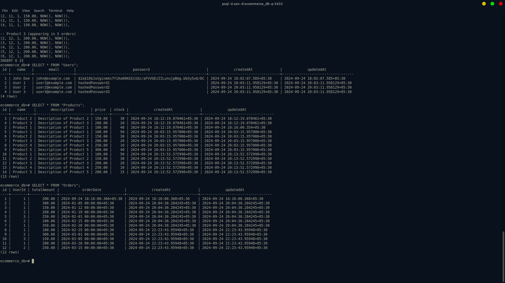

E-Commerce API - Backend System
Project Overview
This project involves developing an E-commerce backend system. The system includes various features such as user authentication, order management, cart functionality, and analytical reporting based on user orders. The backend is built using Node.js, Express, PostgreSQL, and Sequelize ORM.

Table of Contents
Project Features
Technologies Used
Database Schema
API Endpoints
Authentication
Cart Management
Order Management
Reporting and Analytics
Query Performance
Installation Guide
Testing
Conclusion
Project Features
Task 1: Core Functionalities (APIs)
User Authentication:
Signup and Login functionalities with password hashing and JWT authentication.
Cart Management:
Add products to the cart and manage user carts.
Order Management:
Place orders and view order details with products, quantities, and total amounts.
Checkout:
Checkout flow converts cart items to an order and clears the cart.
Reporting and Analytics:
Analytical queries for user and product sales data, including weekly order analysis and product order counts.
Technologies Used
Node.js: Backend runtime environment.
Express.js: Web framework for building RESTful APIs.
PostgreSQL: Relational database management system.
Sequelize ORM: Object-relational mapping for database interaction.
JWT: JSON Web Tokens for user authentication.
bcrypt.js: For password hashing.
Database Schema
The database schema is designed to handle e-commerce functionalities efficiently:

Users Table:

Stores user information (e.g., name, email, password).

Products Table:
 
Stores product information (e.g., name, price, stock).

Carts and CartItems:

Manages user carts, products in carts, and their quantities.

Orders and OrderItems:

 
Tracks user orders, products in orders, and their quantities and prices.

API Endpoints
Authentication APIs
Signup

Method: POST
URL: /api/auth/signup
Body: { "name": "John Doe", "email": "john@example.com", "password": "password" }
Response: Status 201, { message: "User registered successfully" }

Login

Method: POST
URL: /api/auth/login
Body: { "email": "john@example.com", "password": "password" }
Response: Status 200, { token: "JWT_TOKEN" }

Cart Management APIs
Add to Cart
Method: POST
URL: /api/cart/add
Headers: Authorization: Bearer <token>
Body: { "productId": 1, "quantity": 2 }
Response: Status 201, { message: "Product added to cart" }

Order Management APIs
Checkout and Place Order in Single Transaction

Method: POST
URL: /api/orders
Headers: Authorization: Bearer <token>
Body: { "cartId": 1 }
Response: Status 201, { message: "Order placed successfully" }

Get Orders

Method: GET
URL: /api/orders
Headers: Authorization: Bearer <token>
Response: Status 200, returns user order history.

Analytics & Reporting APIs
User-Product Analysis

Method: GET
URL: /api/analysis/user-product
Response: Returns each user's ordered products, their total quantity, and total value.
Query:
sql
Copy code
SELECT 
    u.id AS user_id, 
    u.name AS user_name,
    p.id AS product_id, 
    p.name AS product_name,
    SUM(oi.quantity) AS total_quantity,
    SUM(oi.price * oi.quantity) AS total_value
FROM 
    "Orders" o
JOIN 
    "OrderItems" oi ON o.id = oi."OrderId"
JOIN 
    "Users" u ON o."UserId" = u.id
JOIN 
    "Products" p ON oi."ProductId" = p.id
GROUP BY 
    u.id, u.name, p.id, p.name
ORDER BY 
    u.id, p.id;

Weekly Orders Analysis (Q1 2024)

Method: GET
URL: /api/analysis/weekly-orders
Response: Returns weekly order statistics including total orders, products sold, and total sales.
Query:
sql
Copy code
SELECT 
    DATE_TRUNC('week', o."orderDate") AS week,
    COUNT(o.id) AS total_orders,
    SUM(oi.quantity) AS total_products_sold,
    SUM(oi.price * oi.quantity) AS total_sales
FROM 
    "Orders" o
JOIN 
    "OrderItems" oi ON o.id = oi."OrderId"
WHERE 
    o."orderDate" >= '2024-01-01' 
    AND o."orderDate" < '2024-04-01'
GROUP BY 
    week
ORDER BY 
    week;
 
Top Products (Products with >= 5 Orders)

Method: GET
URL: /api/analysis/top-products
Response: Returns a list of products that were ordered 5 or more times.
Query:
sql
Copy code
SELECT 
    p.name AS product_name,
    COUNT(o.id) AS total_orders
FROM 
    "Orders" o
JOIN 
    "OrderItems" oi ON o.id = oi."OrderId"
JOIN 
    "Products" p ON oi."ProductId" = p.id
GROUP BY 
    p.id, p.name
HAVING 
    COUNT(o.id) >= 5
ORDER BY 
    total_orders DESC;
   
Query Performance
The queries used in this project were optimized to handle large data sets efficiently:

Indexes: Used on frequently searched columns like userId, orderId, and productId to speed up joins and lookups.
Aggregation: Aggregate functions such as SUM, COUNT, and GROUP BY ensure accurate and fast analytical results.
JOIN Performance: Proper use of joins across Orders, OrderItems, Products, and Users tables ensures that queries return results efficiently without unnecessary data duplication.
Installation Guide
Step 1: Clone the Repository
bash
Copy code
git clone https://github.com/AnuragBorisa/Ecommerce-api
cd ecommerce-backend
Step 2: Install Dependencies
bash
Copy code
npm install
Step 3: Set Up PostgreSQL Database
Create a PostgreSQL database.
Update the .env file with your database credentials:
makefile
Copy code
DB_NAME=ecommerce_db
DB_USER=your_db_user
DB_PASSWORD=your_db_password
DB_HOST=localhost
DB_PORT=5432
JWT_SECRET=your_jwt_secret
PORT=8080
Step 4: Run Migrations
bash
Copy code
npx sequelize-cli db:migrate
Step 5: Run the Server
bash
Copy code
npm start
The server will start at http://localhost:8080.
Testing
To test the APIs, you can use Postman or cURL
Signup & Login: Register a user and log in to get a JWT token.
Add Products to Cart: Use the Add to Cart API with the JWT token.
Place Orders: Place orders for the products in the cart.
Analytics & Reporting: Test the analytics endpoints to fetch reports.
Conclusion
This E-commerce backend system is designed with scalability and performance in mind. The API layer offers essential functionalities for managing users, products, carts, and orders while also providing detailed reporting capabilities for user and product analysis. The database schema, queries, and optimizations ensure that the system can handle large data volumes efficiently.

Thank you for reviewing the project! If you have any questions or feedback, please feel free to reach out.